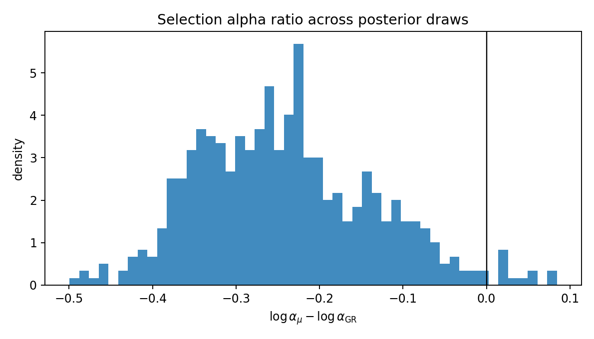
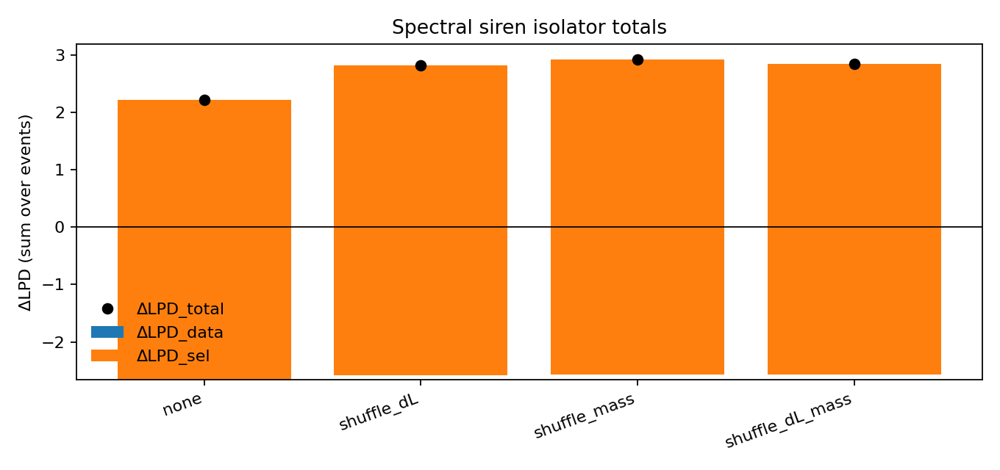
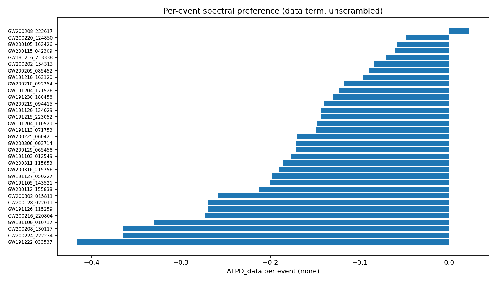

# 2-3-G — Master Report (Selection proxy upgrade + isolator re-run)

Date: **2026-02-03**  
Repo: `simulationstation/Dark_Siren_Ladder_Audit`  

## Executive summary (what this test was)

This report documents a **real-data re-run** of the *spectral-only dark-siren isolator* under a more selection-realistic proxy for the selection normalization term:

- Previously, our μ-vs-GR “selection alpha” proxy used a **1D detectability model** \(p_{\rm det}(\mathrm{SNR})\).
- In this workcycle we upgraded that proxy to a simple **2D** model
  \[
  p_{\rm det}(\mathrm{SNR},\mathcal{M}_{\rm det}),
  \]
  implemented as `det_model=snr_mchirp_binned`.

We then re-ran the isolator battery on the same 33-event set used by the “real-data audit bundle” (`M0_start202`) while keeping the population assumptions aligned with the Gate‑2 control (comoving z prior + PowerLaw+Peak mass model).

### Bottom line

Even after moving to a 2D selection proxy:

- The **data term** still overwhelmingly prefers **GR**.
- The **selection term** still overwhelmingly prefers **μ**, and is large enough to flip the sign of the **total** preference.

This is the **“ghost”** behavior the project is designed to isolate: *model “wins” driven by selection normalization rather than by event data*.

## Artifacts (where to look)

### Tracked (this folder)

Figures referenced below are copied into this report folder so they are visible in git:

- Isolator totals (by scramble mode): `2-3-G/figures/isolator_totals.png`
- Per-event ΔLPD\_data (mode=none): `2-3-G/figures/delta_lpd_data_by_event_none.png`
- Per-event ΔLPD\_total vs ΔLPD\_data (mode=none): `2-3-G/figures/delta_lpd_total_by_event_none.png`
- Selection alpha log-ratio histogram: `2-3-G/figures/log_alpha_mu_minus_gr_hist.png`

### Full raw outputs (gitignored but present locally)

This run’s full output directory:

- `outputs/workcycle_siren_popon_snr_mchirp_20260203_232125UTC/`

Key machine-readable summaries:

- Selection alpha summary JSON:  
  `outputs/workcycle_siren_popon_snr_mchirp_20260203_232125UTC/selection_alpha/tables/selection_alpha_summary.json`
- Isolator totals JSON:  
  `outputs/workcycle_siren_popon_snr_mchirp_20260203_232125UTC/isolator_totals.json`
- Isolator per-event scores CSV:  
  `outputs/workcycle_siren_popon_snr_mchirp_20260203_232125UTC/isolator/tables/event_scores.csv`

## Inputs (what data this used)

### μ / EM reconstruction posterior

- Run directory: `outputs/finalization/highpower_multistart_v2/M0_start202`
- Posterior artifact: `outputs/finalization/highpower_multistart_v2/M0_start202/samples/mu_forward_posterior.npz`
  - Total draws available: **1600**
  - We downselected to **512** draws to match the hierarchical siren run’s recorded `posterior_draw_idx`.

### GW PE cache

We used cached hierarchical PE samples (distance + mass coordinates + analytic PE prior logpdfs):

- `outputs/dark_siren_bigtests_20260202_013848UTC/hier_battery/hierarchical/cache`

Event set size:

- **33 events** (the scored set for `M0_start202` in the hierarchical siren run).

### O3 sensitivity injections for selection proxy

We computed selection normalization proxies from an O3 search-sensitivity injection summary (LIGO-T2100113 style):

- `data/cache/gw/zenodo/7890437/endo3_mixture-LIGO-T2100113-v12-1256655642-12905976.hdf5`
  - IFAR-found threshold: **1 year**
  - Selection z window: **z_max = 0.62**
  - Injections used after cuts/weights (this run): **415,992**

## What changed in code (the key upgrade)

### The selection proxy now supports `snr_mchirp_binned`

The μ-vs-GR selection alpha proxy lives in:

- `src/entropy_horizon_recon/dark_sirens_selection.py`

It previously supported only:

- `det_model=threshold` (hard SNR cut) and
- `det_model=snr_binned` (monotone p_det(SNR) curve).

This work adds:

- `det_model=snr_mchirp_binned`: a monotone **2D** lookup table p_det(SNR, Mchirp_det) built from injections by quantile binning in both axes.

The CLI runner now exposes the new option:

- `scripts/run_siren_selection_alpha.py`

And we added a smoke test verifying a key invariance:

- If μ=1 (so dL_GW==dL_EM), then `alpha_mu == alpha_gr` even under `snr_mchirp_binned`.  
  Test: `tests/test_dark_sirens_selection_alpha_smoke.py`

## Method (what we computed)

### 1) Selection alpha per posterior draw

We compute per-draw selection normalizations:

- \(\alpha_{\mu}(\mathrm{draw})\)
- \(\alpha_{\rm GR}(\mathrm{draw})\)

using a simple injection-rescaling proxy:

1. For each injection \(i\), we have a fiducial distance \(d_{L,\rm fid}(z_i)\) and fiducial optimal SNR \(\rho_{\rm fid}\).
2. For each posterior draw, we compute the model’s predicted distance at that injection’s redshift:
   - GR: \(d_{L,\rm GR}(z)\) from the draw’s \(H(z)\)
   - μ: \(d_{L,\mu}(z)=d_{L,\rm EM}(z)\,R(z)\) with \(R(z)=d_{L,\rm GW}/d_{L,\rm EM}\) from the draw’s μ(A) reconstruction (convention A).
3. We rescale SNR using the standard \( \rho \propto 1/d_L \) approximation:
   \[
   \rho_{\rm eff} = \rho_{\rm fid}\,\frac{d_{L,\rm fid}}{d_{L,\rm model}(z)}.
   \]
4. We evaluate a calibrated detectability proxy:
   - 2D mode: \(p_{\rm det}(\rho_{\rm eff},\mathcal{M}_{\rm det})\)
5. We compute \(\alpha\) as a **weighted expectation** over injections:
   \[
   \alpha(\mathrm{draw}) = \frac{\sum_i w_i\,p_{{\rm det},i}}{\sum_i w_i}.
   \]

Weights include:

- `mixture_weight` (if present)
- `inv_sampling_pdf` (divide by injection sampling pdf)
- optional population weights:
  - `pop_z_mode=comoving_uniform`
  - `pop_mass_mode=powerlaw_peak_q_smooth` (PowerLaw+Peak-like)
- plus a Jacobian correction when the injection `sampling_pdf` is in \((m_1,m_2)\) but the population is in \((m_1,q)\).

### 2) Per-event hierarchical PE term (data term)

For each event we compute per-draw hierarchical PE “event evidences” for μ and GR from PE samples:

\[
\log \mathcal{L}_{{\rm event},M}(\mathrm{draw})
  = \log\left[\frac{1}{S}\sum_{s=1}^{S}
    \frac{p_{\rm pop}(\theta_s \mid M)\,J(\theta_s)}{\pi_{\rm PE}(\theta_s)}\right],
\]

with diagnostics (ESS, good-fraction) recorded to catch heavy-tailed importance weights.

The per-event data preference is summarized as:

\[
\Delta \mathrm{LPD}_{{\rm data},\rm event}
= \log\mathrm{mean}\exp(\log\mathcal{L}_{{\rm event},\mu})
 -\log\mathrm{mean}\exp(\log\mathcal{L}_{{\rm event},\rm GR}).
\]

### 3) Dataset totals and the selection correction (“ghost term”)

We then aggregate across all events \(N\) (here \(N=33\)).

**Data-only_toggle totals**

\[
\Delta\mathrm{LPD}_{\rm data}
= \log\mathrm{mean}\exp\Big(\sum_i \log\mathcal{L}_{i,\mu}\Big)
 -\log\mathrm{mean}\exp\Big(\sum_i \log\mathcal{L}_{i,\rm GR}\Big).
\]

**Selection-on totals**

Given \(\log\alpha_{\mu}(\mathrm{draw})\) and \(\log\alpha_{\rm GR}(\mathrm{draw})\), we form:

\[
\log\mathcal{L}_{\rm total,\mu}(\mathrm{draw})
=\sum_i \log\mathcal{L}_{i,\mu}(\mathrm{draw}) - N\log\alpha_{\mu}(\mathrm{draw}),
\]

and similarly for GR, then take the ΔLPD between the two.

We report an **effective selection contribution** as:

\[
\Delta\mathrm{LPD}_{\rm sel} \equiv \Delta\mathrm{LPD}_{\rm total} - \Delta\mathrm{LPD}_{\rm data}.
\]

Important nuance: because totals use `logmeanexp`, \(\Delta\mathrm{LPD}_{\rm sel}\) is not a strictly additive decomposition of independent terms; it’s a useful diagnostic summary of “how much the selection correction moves the answer.”

### 4) Scramble modes (mechanism-killing nulls)

We ran the isolator with four scramble modes:

- `none`
- `shuffle_dL` (permute dL samples within an event, along with their dL prior values)
- `shuffle_mass` (permute the paired (Mc_det,q) samples within an event, along with their priors)
- `shuffle_dL_mass` (apply both shuffles)

These preserve the **marginals** while killing specific **correlations** in the PE posterior.

## How the test was executed (repro commands)

The workcycle runs two scripts:

1) Selection alpha (μ vs GR), 2D proxy:

```bash
./.venv/bin/python scripts/run_siren_selection_alpha.py \
  --run-dir outputs/finalization/highpower_multistart_v2/M0_start202 \
  --from-dark-siren-summary outputs/dark_siren_bigtests_20260202_013848UTC/hier_battery/hierarchical/summary_M0_start202.json \
  --selection-injections-hdf data/cache/gw/zenodo/7890437/endo3_mixture-LIGO-T2100113-v12-1256655642-12905976.hdf5 \
  --selection-ifar-thresh-yr 1.0 \
  --selection-z-max 0.62 \
  --convention A \
  --det-model snr_mchirp_binned \
  --snr-binned-nbins 200 \
  --mchirp-binned-nbins 20 \
  --weight-mode inv_sampling_pdf \
  --mu-det-distance gw \
  --pop-z-mode comoving_uniform \
  --pop-mass-mode powerlaw_peak_q_smooth \
  --pop-m-taper-delta 3.0 \
  --out outputs/workcycle_siren_popon_snr_mchirp_20260203_232125UTC/selection_alpha
```

2) Isolator battery (uses the alpha arrays above to report ΔLPD\_sel and ΔLPD\_total):

```bash
./.venv/bin/python scripts/run_siren_isolator.py \
  --run-dir outputs/finalization/highpower_multistart_v2/M0_start202 \
  --pe-cache-dir outputs/dark_siren_bigtests_20260202_013848UTC/hier_battery/hierarchical/cache \
  --from-dark-siren-summary outputs/dark_siren_bigtests_20260202_013848UTC/hier_battery/hierarchical/summary_M0_start202.json \
  --n-proc 128 \
  --scramble-modes none,shuffle_dL,shuffle_mass,shuffle_dL_mass \
  --convention A \
  --pop-z-mode comoving_uniform \
  --pop-mass-mode powerlaw_peak_q_smooth \
  --pop-m-taper-delta 3.0 \
  --selection-alpha-npz outputs/workcycle_siren_popon_snr_mchirp_20260203_232125UTC/selection_alpha/tables/selection_alpha.npz \
  --out outputs/workcycle_siren_popon_snr_mchirp_20260203_232125UTC/isolator
```

Operationally, we launched detached with CPU affinity `0-127` and `OMP_NUM_THREADS=1` etc (per `AGENTS.md`).

## Results

### A) Selection alpha ratio across draws

Selection-alpha summary (512 draws):

- `log_alpha_mu_minus_gr` quantiles:
  - p5  ≈ **-0.392**
  - p16 ≈ **-0.346**
  - p50 ≈ **-0.250**
  - p84 ≈ **-0.130**
  - p95 ≈ **-0.061**

Interpretation: α\_μ is typically **smaller** than α\_GR by a factor of about \(e^{-0.25}\approx 0.78\) at the median draw.



### B) Isolator totals (dataset-level)

Totals are from `isolator_totals.json` and reflect \(N=33\) events.

| scramble mode | ΔLPD_data | ΔLPD_sel | ΔLPD_total |
|---|---:|---:|---:|
| none | -2.655 | +4.870 | +2.214 |
| shuffle_dL | -2.582 | +5.396 | +2.814 |
| shuffle_mass | -2.569 | +5.481 | +2.913 |
| shuffle_dL_mass | -2.564 | +5.404 | +2.840 |



Key observation: **ΔLPD_data < 0** in every mode (data prefers GR), while **ΔLPD_sel > 0** in every mode (selection prefers μ), and the selection term is large enough to flip the total.

### C) Win counts (event-by-event)

We define an “event win” by the sign of the per-event ΔLPD (positive = μ wins, negative = GR wins).

Per-event wins by mode:

| mode | events | data-term wins (μ / GR) | total wins (μ / GR) |
|---|---:|---:|---:|
| none | 33 | 1 / 32 | 25 / 8 |
| shuffle_dL | 33 | 1 / 32 | 27 / 6 |
| shuffle_mass | 33 | 2 / 31 | 27 / 6 |
| shuffle_dL_mass | 33 | 2 / 31 | 27 / 6 |

Two diagnostic visualizations for mode=`none`:




In the combined plot, the **dots** are the data term and the **bars** are the total term. The systematic pattern is:

- dots mostly < 0 (GR data preference)
- bars often > 0 (μ total preference after selection correction)

## Why this happens (our best current explanation)

### 1) The data term appears to prefer GR for this event set

Across 33 events, the hierarchical PE integral (with our population weighting and Jacobians) is consistently higher for GR than for μ when averaged via log-mean-exp over posterior draws.

This suggests that, under these modeling choices:

- μ induces a mismatch between the reconstructed EM background + μ(A) mapping and the *observed* GW PE distance information (and its implied redshift mapping under the population prior), so the per-event evidence tends to be lower.

Importantly, the scramble nulls (`shuffle_dL`, `shuffle_mass`, `shuffle_dL_mass`) do **not** remove the sign of the data preference. That indicates the GR-vs-μ data preference is not primarily driven by fragile joint correlations in the PE posterior; it is largely a *marginal-level* effect in the ingredients the event term depends on (dL + mass priors + Jacobians + the draw-to-z inversion).

### 2) The selection term prefers μ because α_μ < α_GR for most draws

The selection correction uses \(-N\log\alpha\). If \(\alpha_\mu < \alpha_{\rm GR}\), then:

- \(\log\alpha_\mu\) is smaller, so \(-N\log\alpha_\mu\) is **larger** (less penalizing),
- which increases μ’s total score relative to GR.

In this run, the selection proxy finds \(\log\alpha_\mu - \log\alpha_{\rm GR}\approx -0.25\) at the median draw, i.e. μ predicts **lower detectability** (lower α) than GR under the chosen mapping (`mu_det_distance=gw`, convention A).

Because \(N=33\), even modest per-draw α-ratio shifts can create order-unity to order-10 changes in totals, which is exactly the “ghost amplifier” effect we are auditing.

### 3) Why 2D selection does not “solve” the ghost

Upgrading from 1D \(p_{\rm det}(\mathrm{SNR})\) to 2D \(p_{\rm det}(\mathrm{SNR},\mathcal{M}_{\rm det})\) makes the selection proxy more realistic with respect to mass dependence, but it does **not** change the core structural issue:

- selection enters as a multiplicative normalization across events,
- it is extremely sensitive to distance rescaling under μ vs GR, and
- it can dominate totals even when the data term prefers the opposite model.

So the ghost persists: the selection normalization is still the lever that can flip conclusions unless Gate‑2-style controls and matched nulls are satisfied.

## Takeaways for the project

1. The ghost mechanism is not an artifact of a simplistic 1D selection curve; it persists under a 2D selection proxy.
2. For this event set and these population assumptions, **GR is strongly preferred by the data term**, while **μ is preferred mainly through selection normalization**.
3. This strengthens (not weakens) the audit narrative: we must treat total “μ wins” as selection behavior until controls and nulls confirm the data term also prefers μ.

