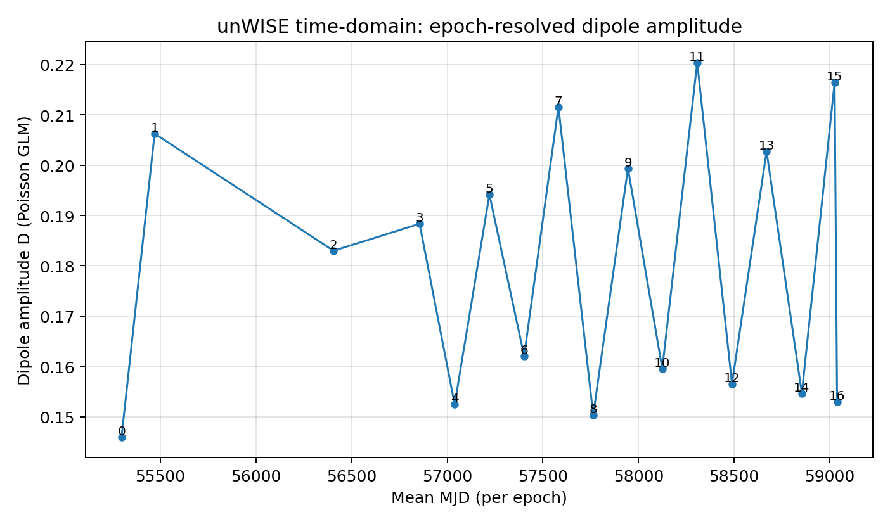
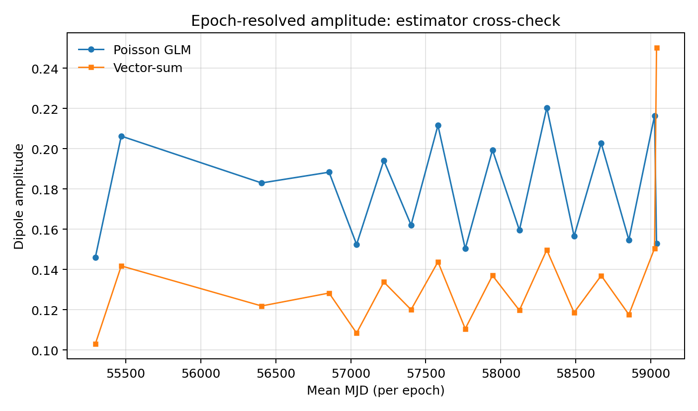
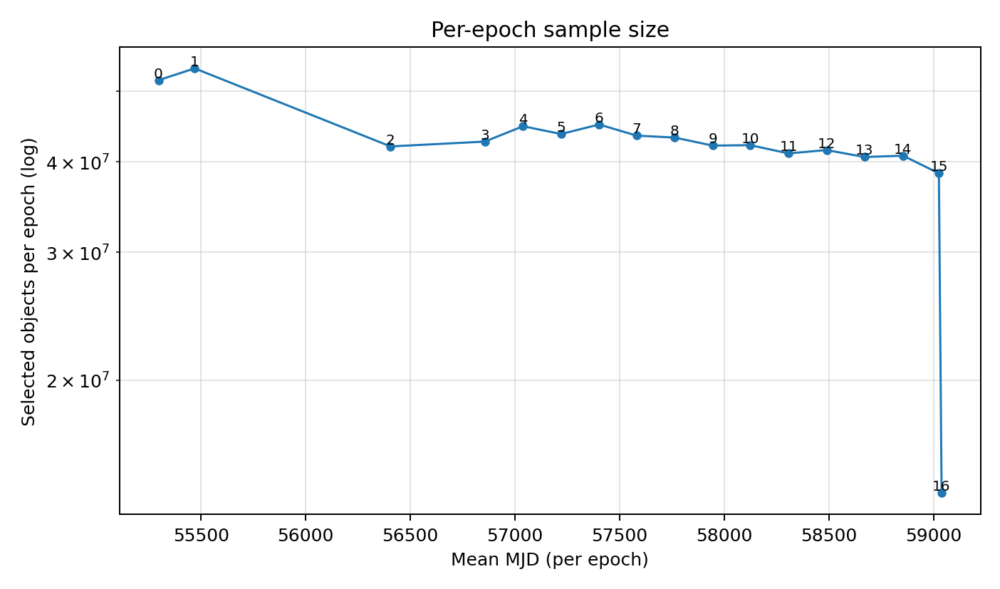

# unWISE time-domain epoch-resolved dipole amplitude (kill-shot time test)

Date: 2026-02-04 (UTC)

This report summarizes a **true time/epoch-sliced** dipole-*amplitude* stability test using the
**unWISE Time-Domain Catalog** (IRSA580; parquet on IRSA S3). The goal is amplitude-only:

- A real cosmological/kine­matic dipole should be **stable across observing epochs**.
- A selection/scan artifact can produce an apparent dipole whose **amplitude varies with epoch**
  (coverage, depth, background, artifacts, pipeline changes).

The headline result here is that the measured dipole amplitude is **strongly epoch-dependent**.

---

## Exact analysis definition

Data product:
- unWISE Time-Domain Catalog (IRSA580), accessed directly from IRSA’s public S3 parquet.
- Epoch index: `EPOCH = 0..16` (17 epochs). The mean times span 2010–2020 (see table in `data/`).

Selection (per epoch; quasar-like, not an exact CatWISE reproduction):
- Quality: `primary==1`, `flags_unwise==0`, `flags_info==0`, `flux>0`, `dflux>0`
- SNR cuts: `flux/dflux >= 5` in both W1 and W2
- Magnitude cut (W1 Vega): `W1 <= 16.4` implemented as `flux_W1 >= 85.254 µJy`
- Color cut (Vega): `W1 - W2 >= 0.8` implemented via flux ratio threshold

Footprint mask (fixed across epochs):
- Secrest-style mask derived from the CatWISE accepted parent:
  - `W1cov >= 80` parent for `mask_zeros` (+ neighbors)
  - `exclude_master_revised.fits` discs
  - `|b| > 30°` (pixel centers)
- HEALPix: `nside=64`, Galactic coords, RING.

Estimator (amplitude-only):
- Primary: Poisson GLM on per-epoch HEALPix counts
  - `log mu_p = beta0 + b · n_p`
  - report `D = |b|` with Fisher sigma
- Cross-check: Secrest-style vector-sum amplitude on the same masked maps

Run implementation:
- Build per-epoch count maps from IRSA580 and fit per-epoch dipole amplitudes.
- Script: `scripts/run_unwise_time_domain_epoch_dipole.py`

---

## Outputs

Finished run (raw outputs):
- `outputs/epoch_dipole_time_domain_20260204_222039UTC/summary.json`
- `outputs/epoch_dipole_time_domain_20260204_222039UTC/D_vs_epoch.png`

This report bundle:
- Data table: `REPORTS/unwise_time_domain_epoch_amplitude/data/epoch_amplitude_table.csv`
- JSON: `REPORTS/unwise_time_domain_epoch_amplitude/data/epoch_amplitude.json`
- Figures:
  - `REPORTS/unwise_time_domain_epoch_amplitude/figures/D_vs_epoch_glm.png`
  - `REPORTS/unwise_time_domain_epoch_amplitude/figures/D_vs_epoch_compare.png`
  - `REPORTS/unwise_time_domain_epoch_amplitude/figures/N_vs_epoch.png`
  - `REPORTS/unwise_time_domain_epoch_amplitude/figures/D_glm_vs_vecsum.png`

---

## Headline results (amplitude-only)

From `data/epoch_amplitude.json` (epochs **0–15**, excluding epoch 16 which has much smaller N and is likely partial):

Poisson GLM amplitude per epoch:
- `D_min = 0.14595` (epoch 0)
- `D_max = 0.22039` (epoch 11)
- `D_range = 0.07444`
- typical per-epoch statistical error: `~3e-4`

Vector-sum cross-check amplitude per epoch:
- `D_min = 0.10297` (epoch 0)
- `D_max = 0.15047` (epoch 15)
- `D_range = 0.04750`

Per-epoch sample sizes (epochs 0–15):
- `N ~ (3.86e7 .. 5.38e7)` selected objects per epoch

Figures:







---

## Interpretation (how this will be seen)

As-is, this is a very strong systematics diagnostic:

- The dipole *amplitude* is **not stable** across observing epochs (2010–2020).
- The variation is **orders of magnitude larger than shot noise**, and it appears under two different amplitude estimators.

That pattern is difficult to reconcile with a single stable cosmological/kinematic dipole, and is
exactly what you expect if the apparent dipole amplitude is driven by **epoch/coverage/depth/background
selection effects**.

Important scope note:
- This uses a **quasar-like** time-domain selection, not the exact CatWISE “accepted” selection.
  So treat this as a *kill-shot stability test* for the hypothesis “the signal is time-invariant,”
  rather than a strict reproduction of the published CatWISE amplitude.

---

## How to reproduce

Run (build maps + fit per epoch):
```bash
source .venv/bin/activate
python3 scripts/run_unwise_time_domain_epoch_dipole.py \
  --outdir outputs/epoch_dipole_time_domain_20260204_222039UTC \
  --nside 64 --b-cut 30 --w1cov-min 80 \
  --w1-max 16.4 --w1w2-min 0.8 --snr-min 5 \
  --n-epoch 17 --n-shards 64 --workers 64 --checkpoint-every 5
```

Report generation (this folder):
```bash
source .venv/bin/activate
python3 scripts/make_unwise_time_domain_epoch_amplitude_report.py \
  --run-outdir outputs/epoch_dipole_time_domain_20260204_222039UTC \
  --report-dir REPORTS/unwise_time_domain_epoch_amplitude
```
